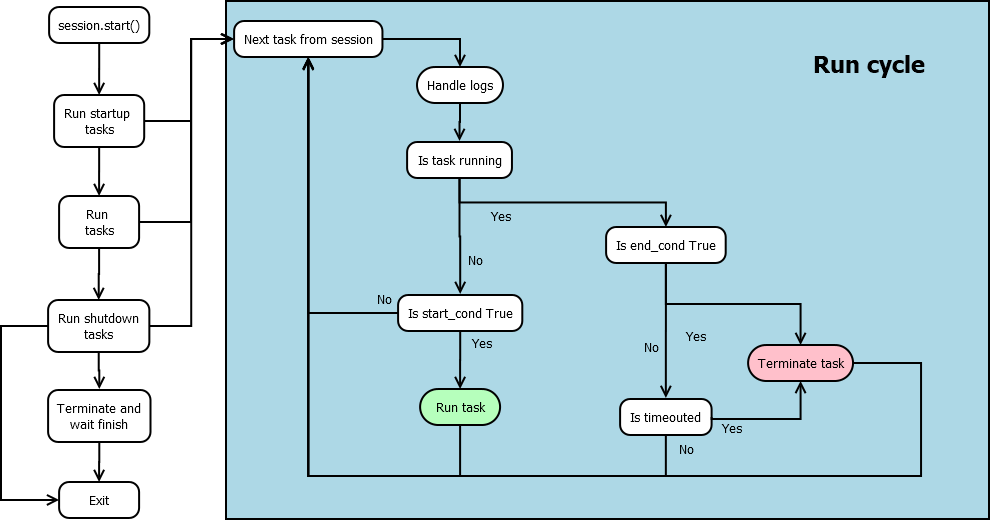
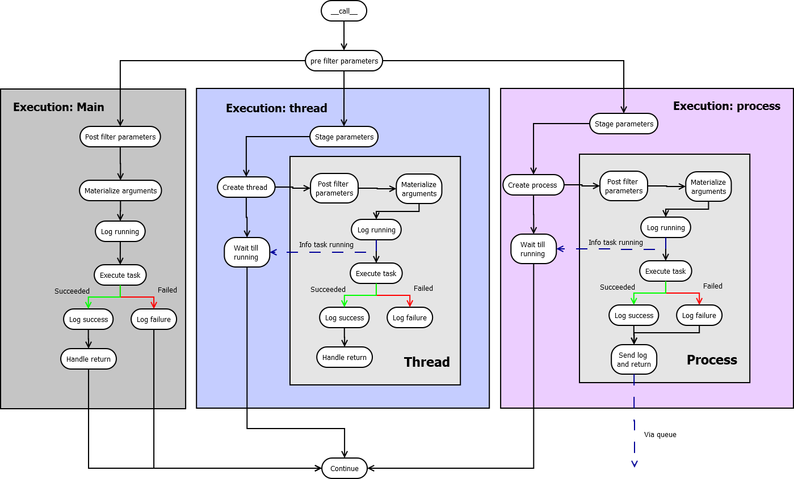

How it works?
=============

There are four core components in Red Engine's ecosystem:

- **RedEngine**: acts as the top level interface
- **Session**: handles the configuration and act as a medium level interface
- **Scheduler**: handles the flow of the system
- **Task**: handles how to execute a task

Additionally there are several subcomponents:

- **Condition**: A statement that is either true or false depending on time or state
- **TimePeriod**: An abstraction of time elements to define time intervals and periods such as today, specific time of day, week etc.
- **Parameters**: Key-value pairs that can be passed to tasks
- **Arguments**: The value of the key-value pair of a parameter

The loggers of the system use logging library's loggers which 
are extended using `Red Bird's RepoHandler <https://red-bird.readthedocs.io/en/stable/logging_handler.html#logging-handler>`_ 
to enable the log records to be read.

Flow of the system
------------------

Task execution
--------------

