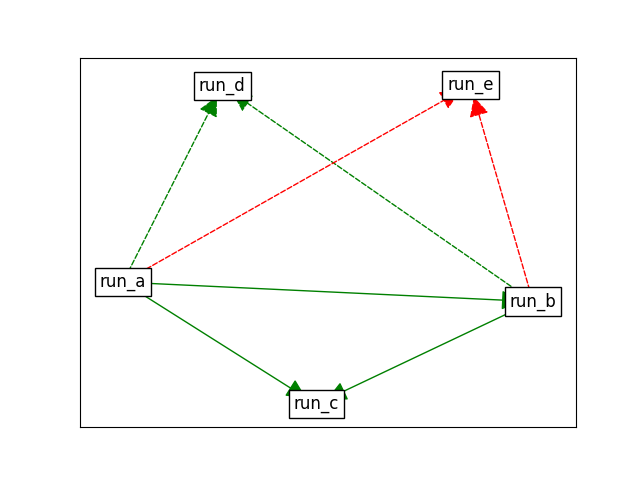

.. _pipeline-guide:

Pipeline Guide
==============

It is quite typical that scheduling projects require some sort of
communication between the tasks such as *run after another task*
or *use the output of another task as input for this task*. Such
complex logic is easy to do with Red Engine. In this section we 
focus on these topics. Please read :ref:`short-guide` to gain
basic undestanding of Red Engine first.

Pipelining Tasks
----------------

First, we discuss about how to pipeline tasks, or how to run a task
after another task has succeeded, failed or started. Pipelining tasks
is easy to do with appropriate start conditions:

.. code-block:: python

    from redengine.tasks import FuncTask
    
    @FuncTask(start_cond="daily")
    def run_first():
        ... # Do stuff

    @FuncTask(start_cond="after task 'run_first'")
    def run_second():
        ... # Do stuff

    @FuncTask(start_cond="after task 'run_second'")
    def run_third():
        ... # Do stuff

We created three tasks: ``run_first``, ``run_second`` and ``run_third``.
Task **run_first** runs once a day and task **run_second** runs when 
**run_first** has succeeded and **run_third** runs after **run_second** has 
succeeded. To be more percise, **run_second** may start only when 
**run_second** has not started after **run_first** has succeeded, and the 
same with **run_third** regarding to **run_second**. Convenient but 
there is more. You can also create pipelines regarding to other statuses
of tasks:

.. code-block:: python
    
    @FuncTask(start_cond="daily")
    def run_first():
        ... # Do stuff

    @FuncTask(start_cond="after task 'run_first' succeeded")
    def run_on_success():
        ... # Do stuff

    @FuncTask(start_cond="after task 'run_first' failed")
    def run_on_fail():
        ... # Do stuff

    @FuncTask(start_cond="after task 'run_first' finished")
    def run_on_success_or_fail():
        ... # Do stuff

Note that the ``run_on_success`` is essentially the same as
``run_second`` from the previous example: if the status is 
not specified, by default it's *success*. 

You can also build more complex logic such as *run when
task a and task b both have succeeded* or *run when either
task a or task b have succeeded* and so on:

.. code-block:: python
    
    @FuncTask()
    def task_a():
        ... # Do stuff

    @FuncTask()
    def task_b():
        ... # Do stuff

    @FuncTask(start_cond="after task 'task_a' & after task 'task_b'")
    def run_when_both_succeeded():
        ... # Do stuff

    @FuncTask(start_cond="after task 'task_a' | after task 'task_b'")
    def run_when_either_succeeded():
        ... # Do stuff

.. note::

    If you have many dependent tasks, you can use a more compact version 
    of the condition syntax for pipelining tasks with **all**:

    .. code-block:: python

        @FuncTask(start_cond="after tasks 'task_a', 'task_b', 'task_c' succeeded")
        def my_task():
            ...

    There is also a compact version for **any** prerequisites:

    .. code-block:: python

        @FuncTask(start_cond="after any tasks 'task_a', 'task_b', 'task_c' succeeded")
        def my_task():
            ...

    Alternatively, you can split them to multiple lines:

    .. code-block:: python

        @FuncTask(start_cond="""
            after task 'task_a' failed 
            | after task 'task_b' failed
            | after task 'task_c' failed""")
        def my_task():
            ...

Pipelining Return
-----------------

Sometimes you may also want to pass the return value of a task as an
input value for another. Doing such logic is handly with Red Engine 
and it works with all execution types (*main*, *thread* and *process*).
Just use the ``Return`` argument:

.. code-block:: python

    from redengine.tasks import FuncTask
    from redengine.arguments import Return
    
    @FuncTask()
    def run_first():
        ... # Do stuff
        return data

    @FuncTask(parameters={"myarg": Return('run_first')})
    def run_second(myarg):
        ... # Do stuff

In simple terms, we set the return value of the task ``run_first`` 
as the input parameter callled ``myarg`` of the task ``run_second``. 
The latest return values of each task are automatically stored to 
``session.returns`` as dict and these can be used by any task with the 
``Return`` argument. 

.. note::

    If you run a task which uses the return value of another task
    and this another task has not prevously run, the value of the
    parameter will be ``None``. You can also specify a default 
    value in case the return value is missing, like 
    ``Return('a task', default='missing return')``.

Putting all Together
--------------------

To final showcase, we make a pipeline to run one task after another
and also set the outputs as inputs to the next tasks:

.. code-block:: python
    
    @FuncTask(start_cond="daily")
    def run_first():
        ... # Do stuff
        return data

    @FuncTask(start_cond="after task 'run_first'", parameters={"myarg": Return('run_first')})
    def run_second(myarg):
        ... # Do stuff
        return data

    @FuncTask(start_cond="after task 'run_second'", parameters={"myarg": Return('run_second')})
    def run_third(myarg):
        ... # Do stuff
        return data

To continue further, you can of course make pipelines where a task is run after two 
tasks have succeeded and the outputs from both of the tasks are used in this task:

.. code-block:: python
    
    @FuncTask(start_cond="daily")
    def task_a():
        ... # Do stuff
        return data

    @FuncTask(start_cond="daily")
    def task_b():
        ... # Do stuff
        return data

    @FuncTask(
        start_cond="after task 'task_a' & after task 'task_b'", 
        parameters={
            "return_of_a": Return('task_a'), 
            "return_of_b": Return('task_b')
        }
    )
    def run_when_both_succeeded(return_of_a, return_of_b):
        ... # Do stuff

Visualizing Pipelines
---------------------

It may become hard to have complete picture of which 
task depend on which when you have several and complex dependencies.
For this purpose, the session object has view ``dependencies``.

To illustrate, first we make some non-trivial dependencies:

.. code-block:: python

    @FuncTask(start_cond="daily")
    def run_a():
        ... # Do stuff

    @FuncTask(start_cond="after task 'run_a'")
    def run_b(myarg):
        ... # Do stuff

    @FuncTask(start_cond="after task 'run_a' & after task 'run_b'")
    def run_c(myarg):
        ... # Do stuff

    @FuncTask(start_cond="after task 'run_a' | after task 'run_b'")
    def run_d(myarg):
        ... # Do stuff

    @FuncTask(start_cond="after task 'run_a' failed | after task 'run_b' failed")
    def run_e(myarg):
        ... # Do stuff

You can display the dependencies as a graph using 
`NetworkX <https://networkx.org/documentation/stable/index.html>`_ 
and `Matplotlib <https://matplotlib.org/stable/index.html>`_:

.. code-block:: python

    import matplotlib.pyplot as plt
    from redengine import session
    session.dependencies.to_networkx()
    plt.show()

You can see that in order to run task ``run_c``, tasks ``run_a`` and ``run_b``
must both run successfully before. To run task ``run_d``, either ``run_a`` 
or ``run_b`` must run successfully while to run task ``run_e`` either 
``run_a`` or ``run_b`` must fail.

You can also put the dependencies to a dict representation and 
iterate them yourself if needed:

.. code-block:: python

    for link_dict in session.dependencies.to_dict():
        ...

